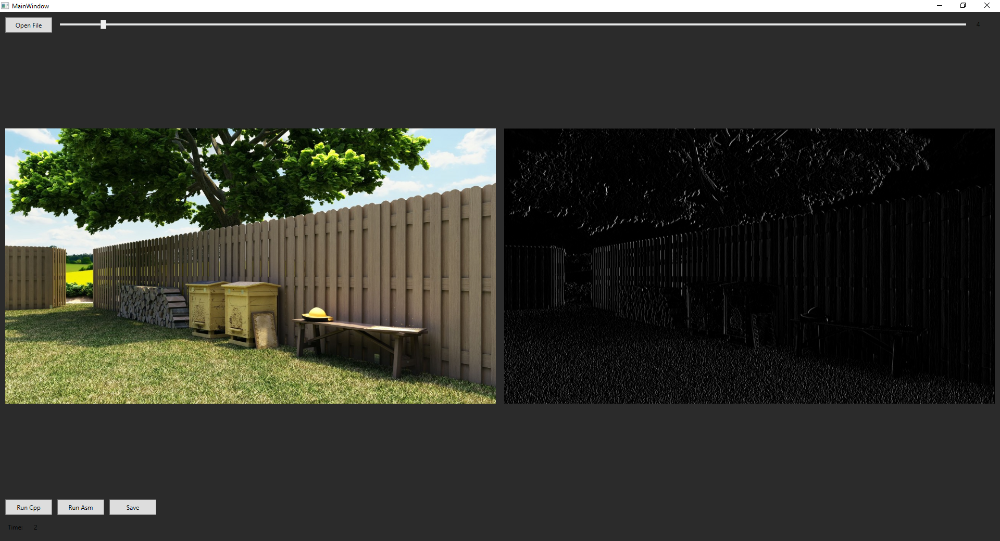

# VERTICAL_FILTER_AVX2
Projekt JA semestr 5 - Vertical filter using AVX2

## App view


## Features
 - Filter written in C++ and ASM AVX2.
 - GUI written in C#.
 - Supports multithreading.
 - Supports images in the BMP format.

## Performance gains for 8K image
 - Maximum acceleration achieved through ASM optimizations: **4.258x**.
 - Average acceleration observed: **3.672x**.

## Vertical filter
<table>
    <tr>
      <td>-1</td>
      <td>0</td>
      <td>1</td>
    </tr>
    <tr>
        <td>-1</td>
        <td>0</td>
        <td>1</td>
    </tr>
    <tr>
        <td>-1</td>
        <td>0</td>
        <td>1</td>
    </tr>
</table>

## Main ASM code
```asm
;;;;;;;;;;;; LOAD FIRST ROW ;;;;;;;;;;;;
MOVUPS   XMM0, XMMWORD PTR [RBX]
VPERMD   YMM0, YMM15, YMM0
VPSHUFB  YMM2, YMM0,  YMM14
VPSHUFB  YMM1, YMM0,  YMM13
VPSHUFB  YMM0, YMM0,  YMM12

;;;;;;;;;;; LOAD SECOND ROW ;;;;;;;;;;;;
MOVUPS   XMM3, XMMWORD PTR [RBX + R14]
VPERMD   YMM3, YMM15, YMM3
VPSHUFB  YMM5, YMM3,  YMM14
VPSHUFB  YMM4, YMM3,  YMM13
VPSHUFB  YMM3, YMM3,  YMM12

;;;;;;;;;;;; LOAD THIRD ROW ;;;;;;;;;;;;
MOVUPS   XMM6, XMMWORD PTR [RBX + R14 * 2]
VPERMD   YMM6, YMM15, YMM6
VPSHUFB  YMM8, YMM6,  YMM14
VPSHUFB  YMM7, YMM6,  YMM13
VPSHUFB  YMM6, YMM6,  YMM12

;;;;;;;;;;;;;;;;; SUM ;;;;;;;;;;;;;;;;;;
VPADDD   YMM0, YMM0, YMM1
VPADDD   YMM0, YMM0, YMM2
VPADDD   YMM0, YMM0, YMM3
VPADDD   YMM0, YMM0, YMM4
VPADDD   YMM0, YMM0, YMM5
VPADDD   YMM0, YMM0, YMM6
VPADDD   YMM0, YMM0, YMM7
VPADDD   YMM0, YMM0, YMM8

;;;;;;;;;;;;; DIVIDE BY 9 ;;;;;;;;;;;;;;
VPSLLD   YMM1, YMM0, 3
VPSUBD   YMM0, YMM1, YMM0
VPSLLD   YMM1, YMM0, 6
VPADDD   YMM0, YMM0, YMM1
VPADDD   YMM0, YMM0, YMM11
VPSRLD   YMM0, YMM0, 12

;;;;;;;;;;;;; APPLY FILTER ;;;;;;;;;;;;;
VPERMD   YMM1, YMM10, YMM0
VPSUBD   YMM0, YMM1,  YMM0

;;;;;;;;;;;;;;;;; RELU ;;;;;;;;;;;;;;;;;
VPXOR    YMM8, YMM8, YMM8
VPMAXSD  YMM0, YMM0, YMM8

;;;;;;;;;;;;;;;; STORE ;;;;;;;;;;;;;;;;;
VPSHUFB  YMM0, YMM0, YMM9
MOVLPD   QWORD PTR [RCX], XMM0
PEXTRB   BYTE PTR [RCX + 8], XMM0, 8
```